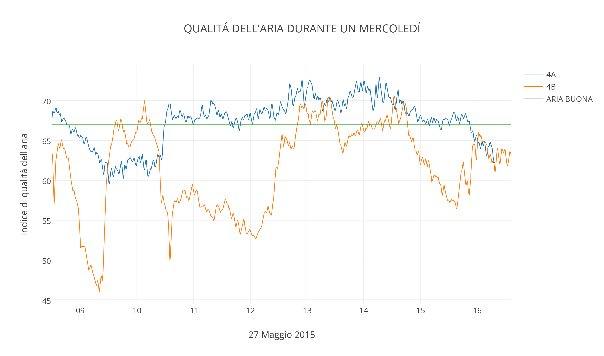
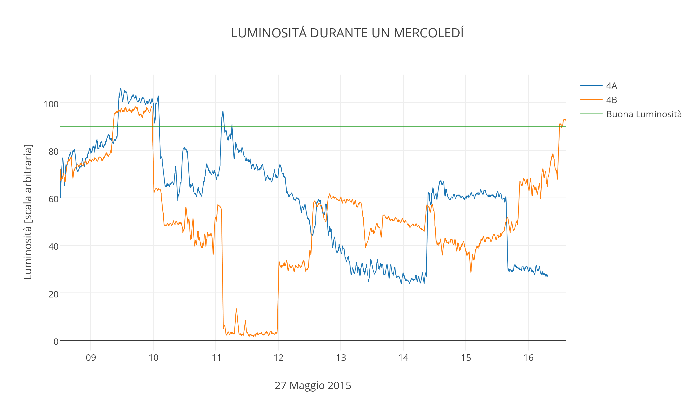
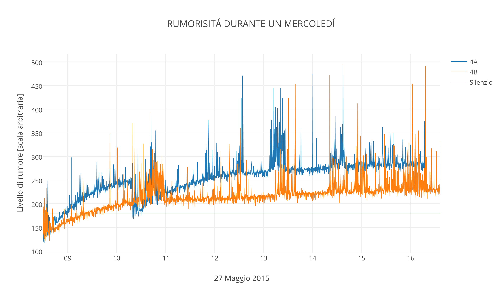
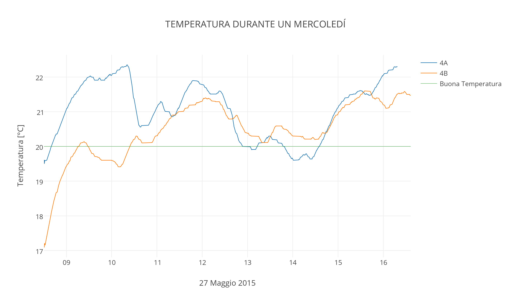
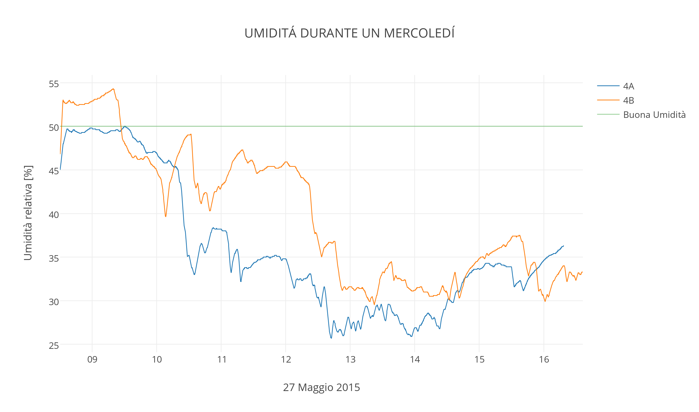

# KitMonitorScuola
Repository del progetto "Impariamo a consumare di meno.." promosso da Gennaro Fanelli e Finanziato dal MIUR nel 2015.
Nella cartella **Tutorial** trovi le istuzioni per costruire il tuo kit di monitoraggio energertico e nella cartella **Kits** ci sono i file di configurazione dei kit attualmente montati e funzionanti.

Un breve indice:

 * [Istruzioni per comprare e costruirti da te il kit] (#sec1)
 * [Il codice da caricare sull'arduino YUN per leggere i sensori e testare il kit] (#sec2)
 * [Il tutorial per collegare il KIT alla wifi e mandare i dati a plot.ly] (#sec3)
 * [I grafici prodotti da una scuola partecipante al progetto] (#sec4)

### Istruzioni per comprare e costruire da te il kit 
All'interno della cartella [Assemblaggio](https://github.com/paolocavagnolo/KitMonitorScuola/tree/master/Tutorial/Assemblaggio) è presente la lista di materiale necessaria per la realizzazione del kit. Sono presenti anche tutti i link per gli acquisti da [Arduino.cc](https://www.arduino.cc/) e [SeeedStudio](http://www.seeedstudio.com/).

Si sottolinea che la prima scelta è stata quella del kit spagnolo [SmartCitizien](https://smartcitizen.me/)

Inoltre è presente il file per tagliare a laser la basetta e la copertura; da portare in qualsiasi Fablab o Makerspace. In zona si segnalano:
* [TechLab] (http://techlab.tl/)
* [FabLab Torino] (http://fablabtorino.org/)
* [FabLab Settimo] (http://www.fablabsettimo.org/)

Tutti gli altri componenti sono facilmente reperibili in ferramenta.

### Il codice da caricare sull'arduino YUN per leggere i sensori e testare il kit 
Una volta assemblato il kit sarà necessario caricare sopra l'arduino il codice necessario per testare i vari sensori. E' possibile comperare svariate tipologie di sensori e, una volta capito il meccanismo illustrato nella cartella [Configurazione](https://github.com/paolocavagnolo/KitMonitorScuola/tree/master/Tutorial/Configurazione), testarli ed utilizzarli.

### Il tutorial per collegare il KIT alla wifi e mandare i dati a plot.ly 
Il passo successivo è quello di collegare il kit ad internet in modo che possa comunicare con il servizio gratuito on-line [plot.ly](https://plot.ly/
Nella cartella [ConnessioneWifi](https://github.com/paolocavagnolo/KitMonitorScuola/tree/master/Tutorial/ConnessioneWifi) sono presenti i link con i tutorial specifici per ogni passaggio e i codici definitivi da caricare sulla scheda.

### I grafici prodotti da una scuola partecipante al progetto 

